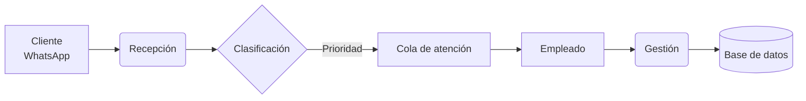
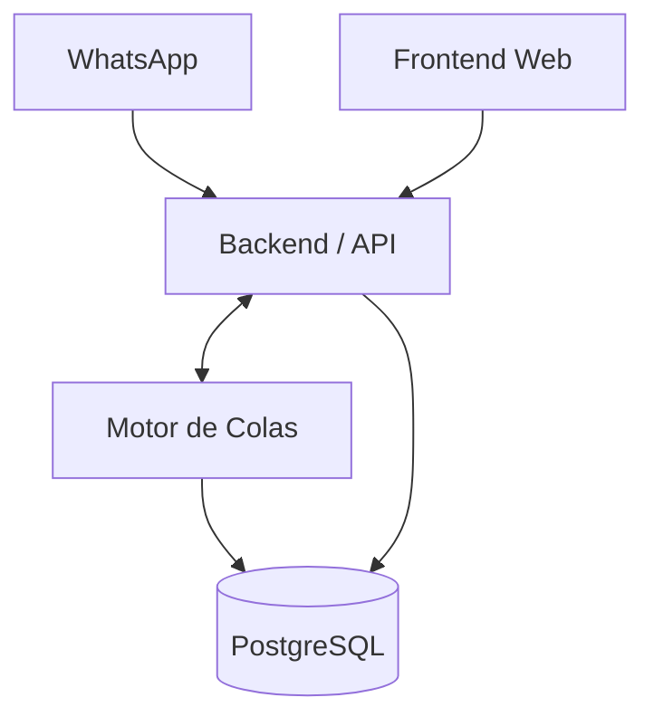

# Sistema de automatización de mensajería
## Basado en teoría de colas para la librería DCCAPA

**Curso:** Testing y Despliegue  
**Integrantes:** Angel Leroy Silva Pusma, Alejandro Apaza, Glender Vargas

---
layout: section
---

# 1. Introducción

---

# Contexto del problema

La librería **DCCAPA** gestiona pedidos y consultas principalmente por WhatsApp.

<v-click>

## :warning: Situación actual
- Atención manual y desordenada de mensajes.
- Dificultad para responder desde varios puntos de trabajo.
- Falta de trazabilidad de pedidos y conversaciones.
- Retrasos que afectan la experiencia del cliente.

</v-click>

<v-click>

> **Ineficaz gestión de pedidos y atención al cliente.**

</v-click>

---

# Planteamiento del problema

## Causas identificadas
- No existe clasificación automática de mensajes por tipo de servicio.
- No hay una **base de datos centralizada** para registrar pedidos.
- La atención simultánea es limitada y genera cuellos de botella.

## Efectos observados
- Retrasos en la atención. 
- Baja productividad del personal. 
- Pérdida de clientes. 
- Falta de control y seguimiento.

---

# Objetivo del proyecto

## Objetivo general
Desarrollar un **sistema web de automatización de mensajes** que mejore la atención al cliente y la gestión de pedidos en la librería DCCAPA.

## Objetivos específicos
- Integrar mensajes de WhatsApp en una interfaz web.
- Clasificar y distribuir chats según prioridad.
- Permitir atención simultánea por varios empleados.
- Registrar pedidos y acciones en una base de datos centralizada.
- Generar reportes para control y toma de decisiones.

---
layout: section
---

# 2. Metodología

---

# Metodología de desarrollo

## Enfoque propuesto
Se trabajará con una metodología **ágil e incremental**, organizando el sistema a partir de historias de usuario.

## Etapas de trabajo
1. **Análisis del problema** y levantamiento de requerimientos.
2. **Diseño del sistema** y prototipos.
3. **Desarrollo incremental** por módulos.
4. **Testing** funcional, integración y despliegue.
5. **Validación** con el caso real de la librería.

## Evidencia de avance
Las historias de usuario HU01, HU02, HU03, HU04, HU11, HU12, HU13 y HU14 definen funcionalidades clave del sistema.

---

# Historias de usuario clave

| Código | Funcionalidad |
|---|---|
| HU01 | Visualizar mensajes de WhatsApp en interfaz web |
| HU02 | Almacenar mensajes localmente |
| HU03 | Gestionar conversaciones individuales |
| HU04 | Enviar y recibir archivos multimedia |
| HU11 | Distribuir chats según prioridad y estación |
| HU12 | Registrar pedidos y acciones automáticamente |
| HU13 | Generar y exportar reportes |
| HU14 | Inicio de sesión seguro con roles |

---

# Estrategia de testing y despliegue

## Testing
- **Pruebas unitarias:** lógica de priorización, autenticación, registro y reportes.
- **Pruebas de integración:** conexión WhatsApp + backend + base de datos + frontend.
- **Pruebas funcionales:** flujo completo de recepción, asignación y atención de pedidos.
- **Pruebas de aceptación:** validación de historias de usuario con criterios definidos.

## Despliegue
- Entorno de desarrollo y pruebas.
- Automatización del despliegue del backend y frontend.
- Monitoreo básico de errores y disponibilidad.

---
layout: section
---

# 3. El proyecto

---

# Solución propuesta

## Idea central
Implementar un sistema que reciba mensajes, los organice en una cola y los distribuya eficientemente entre los empleados.

## Valor que aporta
- Reduce tiempos de espera.
- Mejora la organización de pedidos.
- Facilita la atención simultánea.
- Aumenta el control operativo.
- Mejora la experiencia del cliente.

> La base conceptual del proyecto es la **teoría de colas**, aplicada a la atención de mensajes y pedidos.

---

# ¿Cómo funcionará el sistema?

---

# Funcionalidades principales

## Módulos del sistema
- Bandeja de entrada de mensajes.
- Vista de conversaciones por cliente.
- Priorización y distribución de chats.
- Registro de pedidos e historial.
- Gestión de usuarios y roles.
- Reportes exportables.

## Usuarios del sistema
- **Administrador:** controla, supervisa y genera reportes.
- **Empleado:** atiende conversaciones y gestiona pedidos.

---
layout: section
---

# 4. Arquitectura

---

# Arquitectura general del sistema

## Capas principales
- **Presentación:** interfaz web para administradores y empleados.
- **Lógica de negocio:** recepción, clasificación, asignación y gestión.
- **Datos:** almacenamiento de mensajes, pedidos, usuarios y reportes.

---

# Arquitectura lógica por componentes

## 1. Integración de mensajería
Recibe mensajes desde WhatsApp y los entrega al sistema.

## 2. Backend de negocio
Procesa autenticación, pedidos, conversaciones, distribución y reportes.

## 3. Motor de colas
Aplica reglas de prioridad, orden de llegada y asignación de atención.

## 4. Persistencia
Guarda mensajes, historial, usuarios, estados y métricas.

## 5. Frontend
Permite visualizar conversaciones y operar el sistema en tiempo real.

---
layout: section
---

# 5. Frameworks y tecnologías

---

# Stack tecnológico propuesto

## Frontend
- **React** o **Vue** para la interfaz web.
- **Tailwind CSS** o **Bootstrap** para estilos rápidos y responsivos.

## Backend
- **Node.js + Express** para la API.
- **whatsapp-web.js** para integración con WhatsApp.

## Base de datos
- **PostgreSQL** o **MySQL** para persistencia centralizada.
- **IndexedDB / LocalStorage** para almacenamiento local de mensajes.

## Infraestructura
- **Docker** para empaquetado.
- **GitHub** para control de versiones.
- **Vercel / Render / Railway** o similar para despliegue.

---

# Frameworks según cada necesidad

| Necesidad | Tecnología sugerida |
|---|---|
| Interfaz web | React / Vue |
| API REST | Express |
| Integración WhatsApp | whatsapp-web.js |
| Cola / mensajería interna | RabbitMQ *(opcional para escalar)* |
| Persistencia | PostgreSQL / MySQL |
| Autenticación | JWT + bcrypt |
| Testing | Vitest/Jest, Supertest, Playwright |
| Despliegue | Docker + plataforma cloud |

---

# Justificación tecnológica

## ¿Por qué estas tecnologías?
- Permiten un desarrollo web moderno y escalable.
- Facilitan pruebas y despliegue continuo.
- Son adecuadas para integrar mensajería, roles y reportes.
- Soportan el crecimiento del sistema conforme aumente la demanda.

## Enfoque de escalabilidad
En una primera etapa puede funcionar con integración directa y base de datos centralizada.  
En una etapa posterior, se puede incorporar **RabbitMQ** para una cola de mensajes más robusta.

---
layout: section
---

# 6. Cierre

---

# Resultados esperados

- Mejor organización de la atención al cliente.
- Menor tiempo de respuesta.
- Atención simultánea desde varios puestos.
- Mayor control de pedidos y trazabilidad.
- Mejor productividad del personal.
- Base sólida para testing y despliegue del sistema.

---

# Conclusión

El proyecto propone una solución real a un problema operativo de la librería DCCAPA, combinando:

- **automatización de mensajería**,
- **gestión centralizada de pedidos**,
- **teoría de colas**,
- **arquitectura web escalable**,
- y un enfoque orientado a **testing y despliegue**.

## Mensaje final
**No solo buscamos responder mensajes, sino organizar inteligentemente la atención al cliente.**

---
layout: end
---

# Gracias
## ¿Preguntas?

